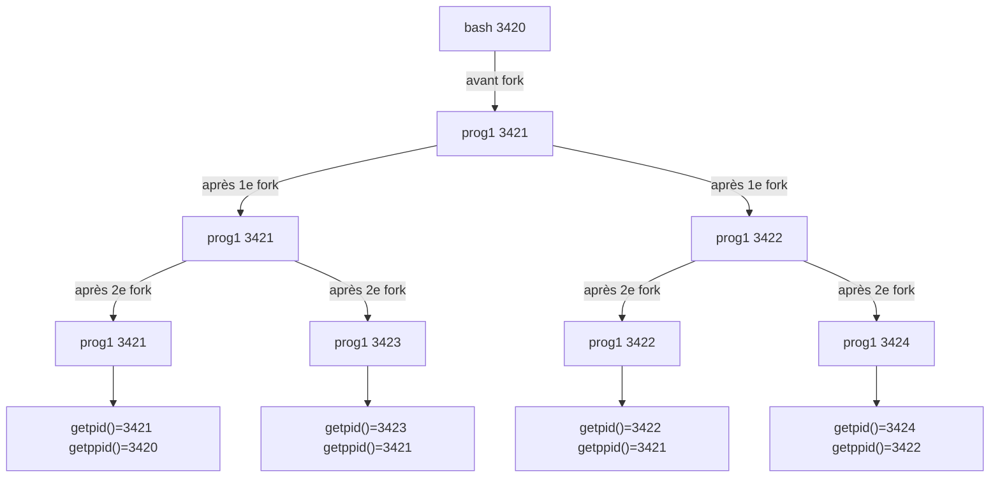

```mermaid
graph TD
	B[bash 3420] -- "avant fork" --> P3421["prog1 3421"]
	P3421 -- "après 1e fork" --> P3421_a["prog1 3421"]
	P3421 -- "après 1e fork" --> P3422["prog1 3422"]
	P3421_a -- "après 2e fork" --> P3421_b["prog1 3421"]
	P3421_a -- "après 2e fork" --> P3423["prog1 3423"]
	P3422 -- "après 2e fork" --> P3422_a["prog1 3422"]
	P3422 -- "après 2e fork" --> P3424["prog1 3424"]
	P3421_b --> R1["getpid()=3421 getppid()=3420"]
	P3423 --> R2["getpid()=3423 getppid()=3421"]
	P3422_a --> R3["getpid()=3422 getppid()=3421"]
	P3424 --> R4["getpid()=3424 getppid()=3422"]
```